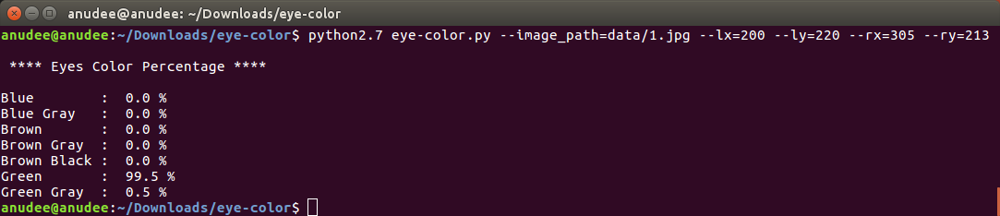

## Eye Color Detection

### References
1. [What color are your eyes exactly?](https://www.edow.com/general-eye-care/eyecolor/)
2. [HTML Color Picker](https://www.w3schools.com/colors/colors_picker.asp?colorhex=ffff00)
3. [What Is the HSV Color Model?](https://www.lifewire.com/what-is-hsv-in-design-1078068)
4. [RGB to HSV color conversion](https://www.rapidtables.com/convert/color/rgb-to-hsv.html)
5. [HSV Color Range](https://github.com/jeffreyolchovy/whatismyeyecolor/blob/master/library/src/main/scala/com/whatismyeyecolor/ColorRange.scala)
